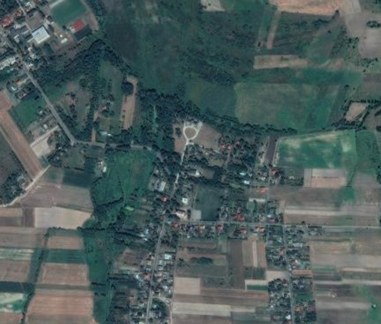
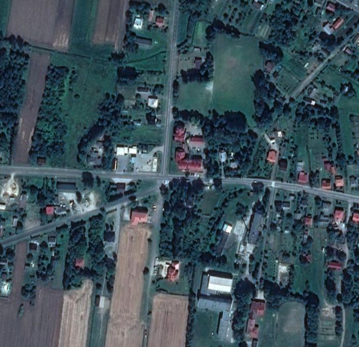
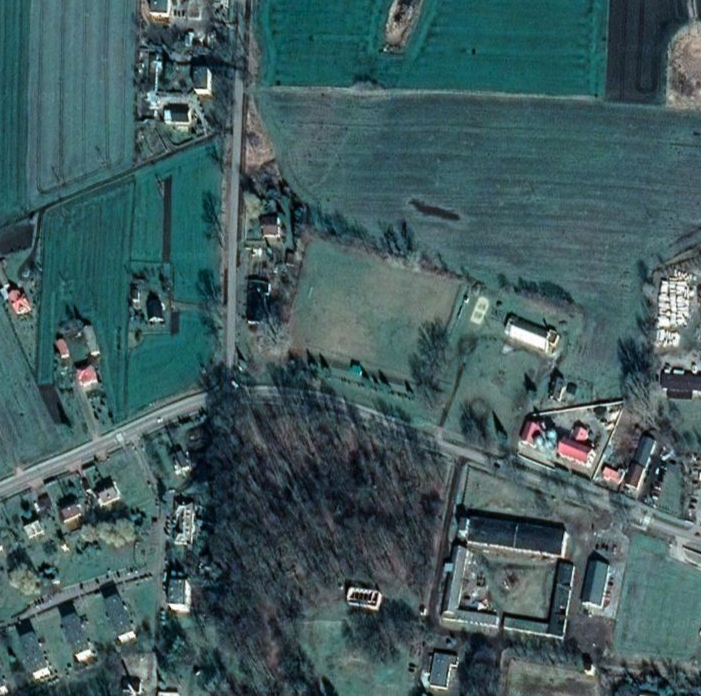
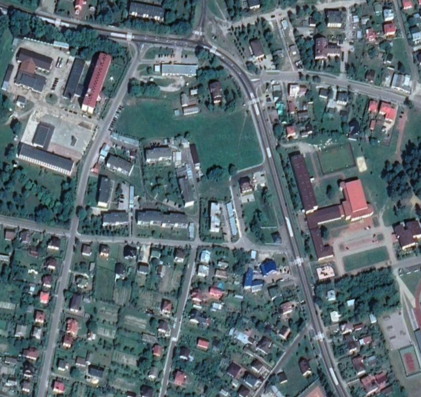
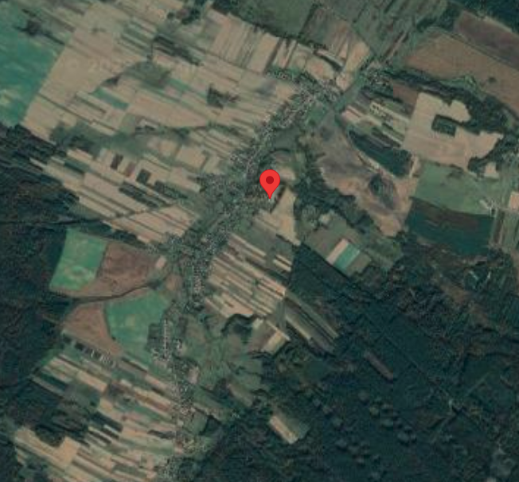
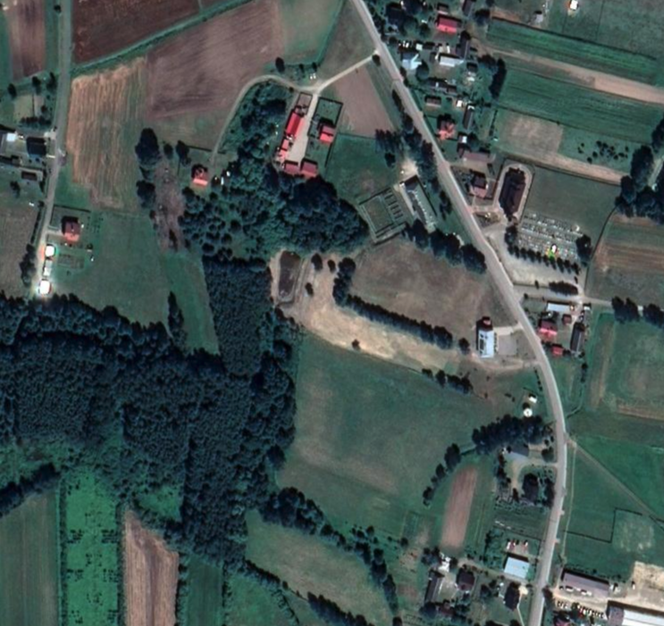
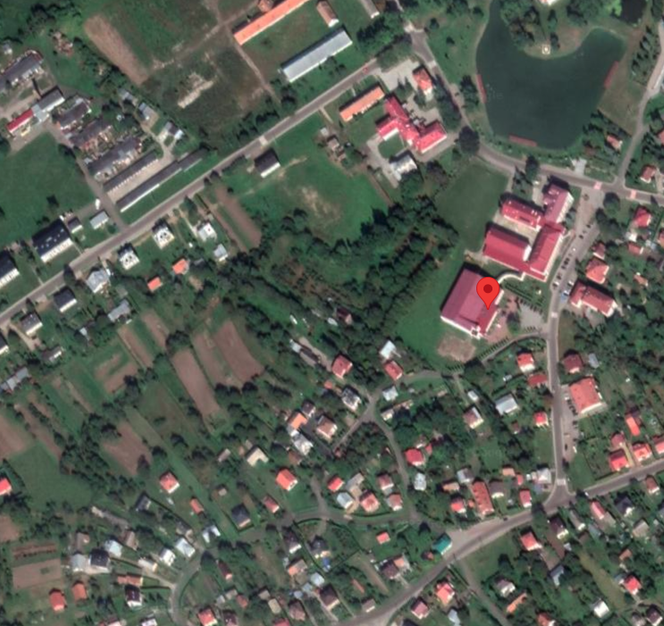

# Refugee Information
## Polish Refugee Locations
It is known that these reception points will offer meals and medical care, as well as a place to rest and receive information: [Source](https://www.aljazeera.com/news/2022/2/24poland-to-set-up-reception-centres-for-fleeing-ukrainian-refugees) 
Contact Hotline: <a href="tel:++48477217575">+48 47 721 75 75</a> 
Receive Refugee Status: [Open Here](https://www.refworld.org/pdfid/46726b102.pdf) 
> __Dorohusk - Reception point__: Suchodolski Palace Communal Culture and Tourism Center, ul. Parkowa 5, 22-175 Dorohusk

As stated in [Polish News](https://polishnews.co.uk/russias-attack-on-ukraine-reception-points-at-the-polish-ukrainian-border-how-does-the-reception-point-in-dorohusk-work/): _refugees are given water and something to eat. Each packed lunch includes a sandwich, yoghurt and fruit_. 

> __Zosin - Reception point__: School Complex in Horodło, ul. Piłsudskiego 58, 22-523 Horodło

> __Dołhobyczów - Reception point__: Border Culture and Recreation Center, ul. Spółdzielcza 8, 22-540 Dołhobyczów

> __Hrebenne- Reception point__: Primary School in Lubycza Królewska (back of the sports hall), ul. Jana III Sobieskiego 5, 22-680 Lubycza Królewska

> __Budomierz - Reception point__: Primary School in Krowica Sama 183, 37-625 Krowica Sama

> __Korczowa - Reception point__: Common room, Korczowa 155, 37-552 Korczowa

> __Medyka - Reception point__: Sports Centre - Medyka 285, 37-732 Medyka

<iframe src="https://www.google.com/maps/d/embed?mid=1QS1ShBfikQHKH-xF2CjEdB45FVaLm6Nb&ehbc=2E312F" width="600" height="200"></iframe>

## Other Refugee Locations
### Hungary
Here's how to get refugee status in Hungary: [Open Here](https://www.unhcr.org/ceu/wp-content/uploads/sites/17/2021/03/Bi-annual-fact-sheet-2021-09-Hungary.pdf)

### Romania
Here's how to get refugee status in Romania: [Open Here](https://www.unhcr.org/4e2d64679.pdf)

### Turkey
Refugee information into Turkey: [Open Here](https://www.mhd.org.tr/images/yayinlar/MHM-14.pdf)

### Czech Republic
Refugee information into Czech Republic: [Open Here](https://www.unhcr.org/4e2d65a79.pdf)

### Slovenia
Immigration to SLovenia: [Open Here](https://www.gov.si/en/policies/state-and-society/immigration-to-slovenia/)

# Seeking Asylum
### Bulgaria
Here's how to seek asylum in Bulgaria: [Open Here](https://migrantlife.bg/articles/asylum-bulgaria)

### Slovakia
How to seek asylum in Slovakia: [Open Here](https://help.unhcr.org/slovakia/asylum/)

### Serbia
Applying for asylum in Serbia: [Open Here](https://help.unhcr.org/serbia/applying-for-asylum-in-serbia/)

### Croatia
Seeking asylum in Croatia: [Open Here](https://help.unhcr.org/croatia/asylum-in-croatia/)

### United Kingdom
Claiming asylum in the United Kingdom: [Open Here](https://www.gov.uk/claim-asylum)

### Canada
Claiming asylum in Canada: [Open Here](https://www.canada.ca/en/immigration-refugees-citizenship/news/2017/03/claiming_asylum_incanadawhathappens.html)

### France
Reception of asylum seekers in France: [Open Here](https://www.ofii.fr/en/procedure/demande-dasile/)

### Italy
Practical guide for asylum seekers in Italy: [Open Here](https://www.interno.gov.it/sites/default/files/allegati/la_guida_in_inglese.pdf)

### Spain
Applying for asylum in Spain: [Open Here](https://help.unhcr.org/spain/en/solicitar-asilo-en-espana/solicitud-de-asilo-en-territorio-espanol-2/)

### The Netherlands
Getting granted asylum in the Netherlands [Open Here](https://www.government.nl/topics/asylum-policy/question-and-answer/eligible-for-asylum-in-the-netherlands)

### Belgium
How to seek asylum in Belgium: [Open Here](https://www.cgra.be/en/international-protection/refugee-status)

### Ireland
Applying for international protection in Ireland: [Open Here](https://www.citizensinformation.ie/en/moving_country/asylum_seekers_and_refugees/the_asylum_process_in_ireland/applying_for_refugee_status_in_ireland.html#l301c8)

### Norway
Applying for asylum in Norway: [Open Here](https://www.udi.no/en/want-to-apply/protection-asylum/?c=ukr)

